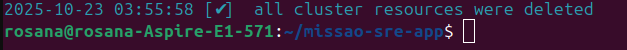

# 🚀 Missão SRE: Plataforma de Containers na AWS

Este projeto é uma demonstração completa de um ciclo de DevOps/SRE, construindo uma pipeline de CI/CD para uma aplicação Python (Flask) e implantando-a em um cluster Kubernetes (AWS EKS).

## 🎯 Objetivo

O objetivo é simular um ambiente de produção real, demonstrando as seguintes habilidades:
* Containerização de aplicações com **Docker**.
* Automação de build e push de imagens com **GitHub Actions (CI)**.
* Provisionamento de infraestrutura como código (IaC) na nuvem com **EKS (via `eksctl`)**.
* Orquestração de containers e implantação com **Kubernetes (Deployment & Service)**.
* Exposição da aplicação para a internet de forma resiliente usando um **Load Balancer**.

---

## 🛠️  Tecnologias Utilizadas

* **Aplicação:** Python (Flask)
* **Containerização:** Docker
* **CI/CD:** GitHub Actions
* **Container Registry:** Docker Hub
* **Cloud Provider:** AWS (Amazon Web Services)
* **Orquestração:** Kubernetes (Amazon EKS)
* **CLI Tools:** `aws-cli`, `kubectl`, `eksctl`

---

## 📖 Estrutura do Projeto

* `app.py`: A aplicação web "Olá, SRE!" em Flask.
* `requirements.txt`: Dependências da aplicação Python.
* `Dockerfile`: Para construir a imagem da aplicação.
* `deployment.yml`: O manifesto Kubernetes que define o `Deployment` (3 réplicas) e o `Service` (LoadBalancer) para rodar a aplicação no cluster.
* `.github/workflows/ci-pipeline.yml`: O workflow do GitHub Actions que automaticamente constrói e publica a imagem no Docker Hub a cada `push` na branch `main`.
* `images/`: Pasta contendo as capturas de tela do projeto.

---

## 📸 Resultados e Demonstrações Visuais

### Fase 1: Aplicação Dockerizada

Aplicação Flask "Olá, SRE!" rodando localmente em um container Docker.

### Fase 2: CI/CD com GitHub Actions

Workflow do GitHub Actions configurado para build e push da imagem Docker.

Imagem da aplicação publicada com sucesso no Docker Hub.

### Fase 3: Cluster EKS na AWS

Criação e status do cluster Kubernetes (EKS) na console da AWS.

### Fase 4: Deploy no Kubernetes

Serviço Kubernetes do tipo LoadBalancer expondo a aplicação para a internet.

Aplicação "Olá, SRE!" acessível via o LoadBalancer da AWS.

### Fase 5: Limpeza do Ambiente

Confirmação da remoção de todos os recursos do cluster EKS.

